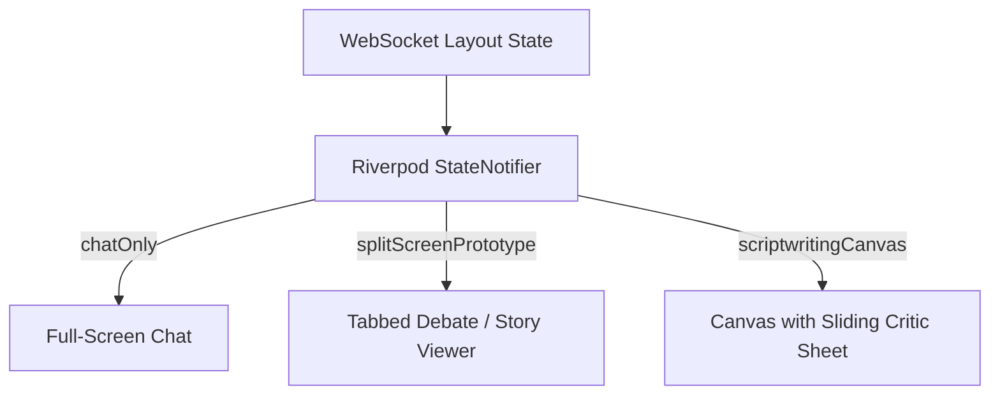

# Mobile Viewport Layout Mapping: Rx.AI Boardroom

This document outlines how the high-fidelity desktop UI prototype (`ui_prototype.html`) is translated to a mobile portrait viewport (phones/tablets) using **Flutter (Dart)** and the selected core libraries (Riverpod, Dio, FlexColorScheme).

---

## 🎨 Global Mobile Design Tokens

To replicate the premium, dark-mode glassmorphic aesthetics of the desktop prototype:
* **Base Theme**: Built using `FlexColorScheme` with a custom dark scheme.
  * Primary Color: `Color(0xFF6366F1)` (Indigo)
  * Secondary Color: `Color(0xFFA855F7)` (Purple)
  * Scaffold Background: `Color(0xFF0A0B0E)` (Deep Space Black)
  * Card/Surface Background: `Color(0xB3111622)` (Glassmorphic dark blue-gray with `BackdropFilter` blur of `8.0` px)
* **Fonts**:
  * Brand/Headings: `Outfit` (loaded via Google Fonts package)
  * Body & Logs: `Inter`
  * Code/JSON Stream: `Fira Code`

---

## 📱 Mobile Viewport Adaptations (Desktop vs. Mobile)

| UI Component | Desktop Layout (`ui_prototype.html`) | Mobile Portait Viewport Layout (`Flutter`) |
| :--- | :--- | :--- |
| **Global Navigation & Sidebar** | Persistent 280px left sidebar containing the Brand logo, Agent Roster, Active Metadata Card, and Simulation Control Panel. | A standard `Drawer` containing the Brand logo, Agent Roster, and Room Settings. A bottom action bar or modal bottom sheet hosts simulation control keys (e.g., Step, Pause). |
| **Top Stage Progress Bar** | Horizontal timeline bar spanning the top with large node circles and labels. | Compact horizontal stepper in the `AppBar` or an expandable stepper row. Displays only the active step label explicitly, showing other steps as small, color-coded node dots (`Active` = Indigo, `Completed` = Emerald, `Pending` = Muted). |
| **Workspace Layouts** | Grid layout with `AnimatedSwitcher` to swap 1-column and 2-column configurations. | Reactive Flutter `LayoutBuilder` that selects mobile-optimized views. Uses standard swipe gestures or tabs instead of horizontal split screens. |

---

## 🔄 Mobile Layout Frame Translations

The FastAPI backend pushes `LayoutFrame` frames as state changes via the WebSocket. The Flutter client translates these states into mobile-optimized widget subtrees.



### 1. `LayoutFrame.chatOnly` (Stages 1 & 2: Requirements & Clarification)
* **Desktop**: Single centered chat column.
* **Mobile Translation**: Full-screen message list.
  * Uses a `ListView.builder` with `chatBubble` widgets.
  * A persistent bottom input bar is pinned above the soft keyboard, housing the `ClarificationPromptWidget` (alert style border and yellow text input container) when active.
  * **Flutter Widget Tree**: `Scaffold` -> `Column` -> `[Expanded(ListView), BottomMessageInput]`.

### 2. `LayoutFrame.splitScreenPrototype` (Stage 3: Roundtable Review)
* **Desktop**: Two-column layout: Left column = Agent debate feeds; Right column = JSON Story Prototype viewer.
* **Mobile Translation**: Horizontal split screen is too cramped. Instead, we use a **Tabbed Navigation** pattern inside the workspace.
  * **Tabs**:
    * **Tab 1: "Roundtable Debate"** — Renders the active discussions, debates, and thinking statuses of the agents.
    * **Tab 2: "Story Prototype"** — Renders the JSON Story Outline or a visual card list (Title, Character cards, setting box, and Puzzle Beats list). A floating icon displays a dot indicator when the JSON updates.
  * **Flutter Widget Tree**: `DefaultTabController` -> `Column` -> `[TabBar, Expanded(TabBarView)]`.

### 3. `LayoutFrame.scriptwritingCanvas` (Stage 4: Drafting)
* **Desktop**: 60% Left column = Streaming draft canvas; 40% Right column = Critic sidebar.
* **Mobile Translation**: The draft reading experience requires maximum screen width. A split screen is unusable.
  * **Solution**:
    * The **Streaming Draft Canvas** takes up 100% of the screen. It displays the text token-by-token with a blinking cursor at the insertion point.
    * A Floating Action Button (FAB) or a persistent bottom pill badge indicates the number of active **Critic comments** (e.g., `"💬 3 Comments"`).
    * Tapping this pill/FAB slides up a **DraggableScrollableSheet** or opens a **Modal Bottom Sheet** containing the `CriticCommentCards` list.
    * Tapping a Comment Card accepts/rejects the feedback, or highlights the corresponding paragraph in the parent canvas text.

---

## 🛠️ Flutter Component Architecture & Bindings

Below is the directory structure mapping and Riverpod bindings for each UI Component:

### 1. `StageProgressBar`
* **File**: `lib/features/boardroom/presentation/widgets/stage_progress_bar.dart`
* **Details**: A stateless widget wrapped in a `PreferredSizeWidget` to serve as a custom `AppBar` bottom widget. It displays a simple custom painter row representing active boardroom graph nodes (`director` -> `tech_sme` -> `writer` -> `critic`).

### 2. `ChatWidget` & `ClarificationPromptWidget`
* **File**: `lib/features/boardroom/presentation/widgets/chat_widget.dart`
* **Details**: Listens to a stream provider of WebSocket events. Auto-scrolls using a `ScrollController` when new messages arrive. If the last message contains a validation request from the Director, it dynamically appends a custom `ClarificationPromptWidget` with a amber-colored border.

### 3. `StoryPrototypeViewer`
* **File**: `lib/features/boardroom/presentation/widgets/story_prototype_viewer.dart`
* **Details**:
  * Toggles between a visual representation (using card UI) and a raw JSON code block (using `Fira Code` styling inside a decorated box).
  * Decodes the string payload `state.storyPrototypeJson` using Flutter's native `jsonDecode` and displays cards containing setting, characters, and expandable puzzle beats.

### 4. `StreamingDraftCanvas`
* **File**: `lib/features/boardroom/presentation/widgets/streaming_draft_canvas.dart`
* **Details**:
  * Uses a standard `SelectableText.rich` widget to display draft text.
  * The blinking cursor at the end is implemented using a custom blinking animation widget (`AnimatedBuilder` toggling opacity of a green `Container(width: 2, height: 16)`).

### 5. `CriticSidebar` / Bottom Sheet
* **File**: `lib/features/boardroom/presentation/widgets/critic_sidebar_sheet.dart`
* **Details**:
  * Rendered inside a `DraggableScrollableSheet` at the bottom of the drafting screen.
  * Contains list items displaying individual comments with action buttons (Accept / Reject / Discuss).
  * Clicking "Accept" sends a JSON payload to the backend WebSocket connection to trigger the writer's update.

---

## 🔄 State Synchronization Diagram

```text
               +----------------------------------+
               |        FastAPI WebSocket         |
               +-----------------+----------------+
                                 |
                                 | WS Event Stream (JSON)
                                 v
               +-----------------+----------------+
               |       Dio / WebSocket Channel    |
               +-----------------+----------------+
                                 |
                                 v Stream
               +-----------------+----------------+
               |  Riverpod StreamProvider (Raw)   |
               +-----------------+----------------+
                                 |
                                 v parse
               +-----------------+----------------+
               |  BoardroomStateNotifier (State)  |
               +-----------------+----------------+
                                 |
                 +---------------+---------------+
                 |                               |
                 v updates UI                    v morphs view
      +----------+-----------+       +-----------+-----------+
      |  Active Widget Tree  |       | AnimatedSwitcher View |
      +----------------------+       +-----------------------+
```
