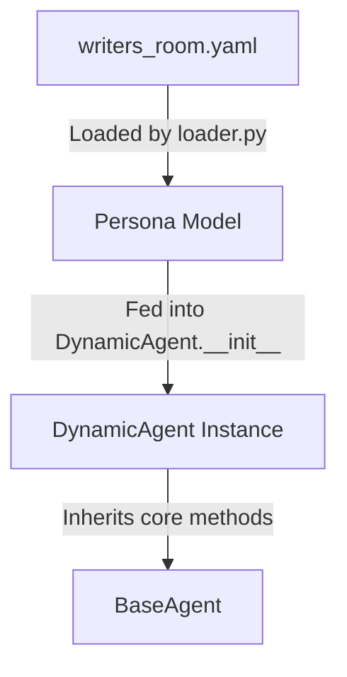

Here is the updated project plan, refactored to transition from a hardcoded "Writer's Room" to a highly extensible, **Configuration-Driven Architecture**. This will allow you to instantly spin up an Agentic Group Chat, a Shark Tank, or a Drug Design lab simply by swapping out a configuration file.

# AI Boardroom — Project Plan

> **Status**: ✅ Core backend scaffolded. 🔄 Refactoring for Extensibility (Phase 2 active)
> **Last Updated**: 2026-06-10

---

## Project Overview

A highly scalable, multi-workflow orchestration platform. By utilizing **Room Templates**, the system dynamically instantiates specialized AI personas, custom state machines, and dynamic action tools to simulate any collaborative environment (Writer's Room, Shark Tank, Drug Design Lab, etc.). Orchestrated via LangGraph on a FastAPI backend with WebSocket streaming.

---

## Architecture (Configuration-Driven)

```text
POST /ai_room/create
        │ Loads JSON/YAML Room Template (e.g., shark_tank.yaml)
        ▼
  [Initialization]
  System dynamically provisions Personas, Tools, and Stage Logic
        │
        ▼
  [Continuous Loop / Dynamic Stages]
  Client ──── WS Stream ───► Orchestrator Agent (Silent Semantic Router)
                                │
                                ├── intent_analysis?
                                ├── tool_routing?
                                │
                                ▼
  [Agent Action Space]
  Dynamic Agent A (e.g., Investor) ──► Uses Tool (e.g., make_offer())
  Dynamic Agent B (e.g., SME)      ──► Processes silently in isolated scratchpad
                                │
                                ▼
  Orchestrator Agent ──► Synthesizes actions ──► Updates Synchronized Shared Memory
                                │
                                ▼
  [Dynamic UI Rendering]
  FastAPI pushes UI Layout Frames (e.g., {"layout": "split_screen_deal_tracker"}) alongside tokens

```

---

## Technology Stack

| Layer | Technology |
| --- | --- |
| Backend API | Python FastAPI |
| Configuration | YAML / JSON (Room Templates) |
| Streaming | WebSockets (FastAPI native) |
| Agent Orchestration | LangChain + LangGraph (Dynamic Graph Building) |
| LLM Clients | Google Gemini (genai), OpenRouter |
| Auth | JWT (python-jose) via `Sec-WebSocket-Protocol` header |
| Frontend | React + Vite + TypeScript + Zustand (Componentized UI) |
| Validation | Pydantic v2 |

---

## Isolation Rules (Enforced)

| Role | Private Scratchpad | Public Group Chat Output |
| --- | --- | --- |
| **Orchestrator** | Intent analysis, routing decisions, tool evaluation | UI Layout frames, synthesized summaries, turn handoffs |
| **Dynamic Agent** | Intermediate reasoning, domain-specific calculations | Final structured output (e.g., `DealOffer`, `MolecularStructure`, `ScriptDraft`) |

**Enforcement mechanism:**

* Each agent holds `_scratchpad: list[dict]` — a private instance variable.


* Scratchpad is populated by `agent.think()` (private reasoning).


* Scratchpad is **cleared** by `agent.respond()` after producing the public output.
* 
`RoomSharedState` (the LangGraph shared state) **never contains scratchpad data**.


* The Orchestrator manages these scratchpads to let agents formulate thoughts before speaking.


---

## Repository Structure

```text
V0005_Extensible_AI_Boardroom/
├── backend/
│   ├── main.py                          ✅ FastAPI app factory
│   ├── requirements.txt
│   ├── .env.example
│   │
│   ├── core/
│   │   ├── config.py                    ✅ Pydantic-settings
│   │   ├── security.py                  ✅ JWT via WS protocol
│   │   └── templates/                   🔄 NEW: Room Configurations
│   │       ├── writers_room.yaml
│   │       ├── shark_tank.yaml
│   │       └── drug_design.yaml
│   │
│   ├── agents/
│   │   ├── base_agent.py                ✅ BaseAgent with isolated _scratchpad
│   │   ├── orchestrator.py              🔄 NEW: Silent semantic router
│   │   ├── dynamic_agent.py             🔄 NEW: Instantiated via Room Template
│   │   └── tools/                       🔄 NEW: Dynamic Tool Registry
│   │       ├── script_tools.py
│   │       ├── investor_tools.py        (e.g., make_offer)
│   │       └── biotech_tools.py
│   │
│   ├── graph/
│   │   ├── state.py                     ✅ RoomSharedState TypedDict
│   │   ├── nodes.py                     ✅ Generic node execution functions
│   │   └── dynamic_graph_builder.py     🔄 NEW: Compiles LangGraph dynamically from template stages
│   │
│   ├── llm_clients/                     ✅ (Untouched) Gemini & OpenRouter clients
│   ├── api/
│   │   ├── schemas.py                   ✅ Pydantic request/response models
│   │   └── routes/
│   │       ├── auth.py
│   │       └── room_manager.py          🔄 NEW: Handles template loading and WS /ws/room/{id}
│   │
│   └── tests/
│
├── frontend/
│   ├── package.json
│   └── src/
│       ├── api/
│       ├── store/
│       └── components/                  🔄 NEW: Pluggable UI widgets
│           ├── layouts/                 (ChatOnly, SplitScreen, Canvas)
│           └── widgets/                 (DealTracker, ScriptSidebar, MoleculeViewer)
└── plan.md

```

---

## Phase Roadmap

### ✅ Phase 1 — Core Infrastructure (DONE)

* Backend FastAPI application factory & JWT security.
* BaseAgent with isolated private scratchpad.


* LangGraph shared state documented isolation boundary.


* `WS /ws/boardroom/{session_id}` with JWT via `Sec-WebSocket-Protocol`.

### 🔄 Phase 2 — Configuration-Driven Refactoring (Current)

* [x] Implement `Room Templates` loader (parse YAML/JSON configs for personas and stages).


* [x] Build the `dynamic_graph_builder.py` to compile LangGraph state machines based on the loaded template's stages.


* [x] Replace hardcoded Director/Writer with a generic `DynamicAgent` class that absorbs a persona from the config.

* [x] Finalize the user journey for the writers' room flow - what is the steps happening in each stage, and what are the parameters which decide the completion of the stage, and what is the conversation, etc within each step of each stage. 

* [x] Add the activities for the tech_SME RAG pipeline & also feature list based on free members and paid members.

* [x] Update the base agent so that it includes the characteristic parameters of different agents.

* [x] Understand what exactly is happening in Agents currently and what will be the process of creating a new template room as well as how to create new agents ? What will be the process to create the Director, Tech SME, Writer, Critic?

* [x] Explain to me what we are doing in test_dynamic_agent.py : Do create the Director agent in test_dynamic_agent.py, and also test out the different methods for the director agent. and run test_dynamic_agent.py annd create the environment, etc to make sure we are able to get this running successfully for a dummy testcase.

* [ ] Develop a minimalistic FastAPI mock server that returns hardcoded JSON responses and simulates a basic WebSocket text stream.

* [ ] Connect the dummy Flutter application to the mock backend to validate the UI layout shifts, state management, and streaming text rendering.

* [ ] Finalize the JSON schemas for the API contract based on the mock integration learnings.

* [ ] Finalize the format of the JSON story prototype.

* [ ] Create all the agents using the role, system prompt for Director, Tech SME, Writer, Critic. Make sure the invoke method is implemented properly with the user prompt as per chat : https://gemini.google.com/share/811172d56741.

* [ ] Implement the silent `Orchestrator` agent to handle routing and turn-taking.


* [ ] Build the `Tool Registry` to assign environment-specific action spaces (e.g., `make_offer` tool for Shark Tank).


* [ ] Create the end-to-end flow from the FastAPI endpoint for the `writers_room` flow for the different stages implementation and responses from each of the agents.

* [ ] **[INTEGRATION: FEATURE 1 BACKEND]** Build a Character roleplay simulator where we can have scenes and characters will talk to each other in that scene as per their consistent character.

Suggestion by Gemini for implementation : Create a generic `SimulationSubGraph` compiler inside `dynamic_graph_builder.py` that takes character blueprints from the story prototype and maps them to short-context execution nodes.

* [ ] **[INTEGRATION: FEATURE 1 BACKEND]** Create specialized tools for the Director agent within the simulation track: `spawn_scene_sandbox()` to trigger character loop, `inject_environmental_event()` to break conversation loops, and `evaluate_plot_consistency()` to validate narrative logic and alter the main state's JSON blueprint based on results.

* [ ] Do the backend testing for the end-to-end `writers_room` flow for 5 different test scenarios.

### 🔲 Phase 3 — Componentized Frontend UI
* [x] Finalize the Frontend UI Tech stack for a mobile application - Android or IOS deployment - I prefer Flutter personally but ok to proceed with what will be best in terms of user experience.
* [x] Create the UI pages for the mobile application, and make sure they are user friendly and easy to navigate. Refer to user_journeys_0001_writers_room.md to make sure we are giving a great user experience.
* [x] Freeze the front-end framework to **Flutter (Dart)** and map how the desktop-style prototype translates to a mobile viewport (Completed: see [mobile_layout_mapping.md](file:///c:/Users/ABC/Projects/A0011_RxAI_YT_Videos/V0004_Agentic_AI_Boardroom/docs/mobile_layout_mapping.md)).
* [x] Create the mobile layout HTML mockup similar to the ui_prototype.html (Completed: see [ui_prototype_mobile_app.html](file:///c:/Users/ABC/Projects/A0011_RxAI_YT_Videos/V0004_Agentic_AI_Boardroom/frontend/ui_prototype_mobile_app.html))

* [x] Complete installation of Flutter, Android Studio *(Completed: July 5, 2026)*
  * **Summary:** Fully configured the environment with zero errors by following the Gemini steps. 
  * **Tutorial Note:** Emphasize that a complete restart of Antigravity is strictly required after updating the system `PATH` for the built-in terminal to recognize the `flutter` command.

* [x] Scaffold the base Flutter project and build the static UI structure (Layouts, Tabs, and Navigation) based on the mobile mockup *(Completed: July 5, 2026)*
  * **Summary:** Initiated the task by reviewing the implementation plan with Gemini for an independent quality check. Following the review, Antigravity successfully generated the entire base project scaffolding and static UI structure in just 15 minutes. It did the job of converting the html mockup to a flutter mockup perfectly. However, I realized that after this step, there is a need to not just have a mockup but proper flow of data even though its dummy data, there should be clear communication from flutter ui for each button click so that i can also identify and design the backend endpoints accordingly. Hence, based on this learning, I added the Interactive state mocking and API contract definition as the next task.
  * **Tutorial Note:** Show how to test the resulting build immediately in the browser by running `flutter run -d chrome` from the terminal.

* [x] **Setup Riverpod state management** (using `Notifier` or `AsyncNotifier` + Streams) to manage UI layout frames (`LayoutFrame`) and `currentStage` using a temporary **Interactive State Mock**.
* [x] **Build Interactive Mocks for UI Components:**
    * [x] Wire the chat input's "Submit" button to append user messages to the Riverpod state, simulating a 1-second delay for the "Agent Response."
    * [x] Create a dummy JSON string representing the Director's "Story Prototype" and wire it into the Stage 3 `StoryPrototypeViewer` widget.
    * [x] Setup a simulated text stream (using `Stream.periodic`) to feed fake tokens into the Stage 4 `StreamingCanvas` to test real-time rendering.

* [x] **Draft the Formal API / WebSocket Contract:** Documented the exact JSON schemas required from the FastAPI backend (e.g., `{"type": "token", "content": "..."}` and `{"action": "accept_critique", "comment_id": "c-123"}`).
* [x] **Build dynamic layout screens:** Use `AnimatedSwitcher` or an `IndexedStack` tied to the Riverpod `currentStage` state to verify that transitioning between Stage 2 (Chat) and Stage 3 (Split Screen) happens seamlessly via the mock toggle.
* [x] **Develop and polish the individual stateless UI Widgets:** Cleaned up the `ChatWidget`, `ClarificationPromptWidget`, `StoryPrototypeViewer`, `StreamingCanvas`, and `CriticCards` so they perfectly accept and display the new dummy data models.

* [ ] Prepare the Youtube Videos 1-3

### 🔲 Phase 4 — Testing & Production Hardening

* [ ] Integration tests for template loading and dynamic graph building.
* [ ] Test the Orchestrator's ability to isolate scratchpads across different dynamic agents.

* [ ] **[INTEGRATION: PAID TIER GUARDRAILS]** Write automated unit tests to verify memory tier access limitations (asserting that Free tier users reject processing with deep L4 summarized memory or automated character simulations).
* [ ] **[INTEGRATION: LOGGING SANDBOX OVERHEAD]** Establish isolated Redis Pub/Sub channels explicitly for character sub-agent timeline observation records to keep main boardroom tracking telemetry completely clean.

* [ ] Replace stub user store with PostgreSQL/NeonDB.
* [ ] Docker Compose (backend + frontend) & CI/CD pipeline.

### 🔲 Phase 5 — Go-To-Market & Business Operations (H2 2026)

* [ ] Prepare the Youtube Videos 4-6

* [ ] **Legal Registration:** Register as a Sole Proprietorship via the Udyam portal (MSME) to establish a formal entity quickly without overhead.
* [ ] **Financial Setup:** Open a business Current Account to strictly separate SaaS and YouTube revenue from your primary 35 LPA salary. Also decide a suitable price point for SaaS products suite based on deep research. Basic pricing_strategy.md is ready.

* [ ] **[INTEGRATION: PACKAGING PREMIUM VALUE]** Update `pricing_strategy.md` to cleanly gate these new modules:
  * *Studio Tier ($5):* Access to automated Director persona generation.
  * *Executive Tier ($20):* Full access to custom character simulation graphs, manual sandbox interaction tools, and automated structural plot healing.

* [ ] **Payments & Compliance:** Complete GST registration (necessary for international software service export) and finalize Stripe/Razorpay merchant approval.
* [ ] **Sponsorship Outreach:** Create a 1-page channel Media Kit and execute cold email pitches to target AI developer tools (e.g., Pinecone, LangChain) to secure the 3 video sponsorships.

* [ ] Release the Youtube Videos 7-10.

* [ ] **Launch Wedge Execution:** Draft distribution posts and map out the release schedule for developer communities, including Hacker News, Reddit (r/LocalLLaMA, r/SideProject), and X/Twitter.
---

## Actual Implementation order

*This section tracks the chronological order in which features were actually implemented, bridging across different planned phases. This will help formulate videos or guides on the actual approach used.*

### 1. Backend Core & Configuration (From Phase 2)
* [x] Implement `Room Templates` loader (parse YAML/JSON configs for personas and stages).
* [x] Build the `dynamic_graph_builder.py` to compile LangGraph state machines based on the loaded template's stages.
* [x] Replace hardcoded Director/Writer with a generic `DynamicAgent` class that absorbs a persona from the config.
* [x] Finalize the user journey for the writers' room flow.
* [x] Add the activities for the tech_SME RAG pipeline & feature list.
* [x] Update the base agent with characteristic parameters.
* [x] Create and test Director agent in `test_dynamic_agent.py`.

### 2. UI Mockup & Frontend Pivot (From Phase 3)
* [x] Finalize UI tech stack (Flutter).
* [x] Setup environment (Flutter/Android Studio).
* [x] Scaffold base project and static UI.
* [x] **Setup Riverpod state management & Mocks:** Implemented Riverpod Notifiers and StreamProviders to simulate interactive states (delayed chat responses, token streaming) without a backend.
* [x] **Draft Formal API Contract:** Created `docs/api_contract.md` to finalize the `BoardroomEvent` JSON schema needed by the frontend, acting as a strict target for backend phase 4.
* [x] **Widget Implementation:** Completed `ChatWidget`, `StoryPrototypeViewer`, `StreamingCanvas`, and `CriticCommentCards` utilizing mock data providers.

---

## Key Design Decisions

1. 
**Room Templates (YAML/JSON)**: Moving away from hardcoded logic, the application flow is now entirely dictated by config files defining the roster, the stages (e.g., `["pitch", "q_and_a", "bidding"]`), and the required tools.


2. **The Silent Orchestrator**: The "Director" is replaced by a background Semantic Router. It analyzes user intent and dictates which agent acts, removing the reliance on a visible "boss" agent for casual group chats or adversarial formats like a Shark Tank.


3. **Dynamic UI Rendering**: The frontend no longer follows a linear progression. The backend pushes UI layout frames (e.g., `{"layout": "split_screen_deal_tracker"}`). The React client intercepts these frames and mounts widgets dynamically, allowing a single frontend to support entirely different use cases.


4. **Environment Action Spaces (Tools)**: Agents are granted specific capabilities based on the active template. A Shark Tank investor agent can execute a `make_offer()` function, which the backend routes directly to the frontend's Deal Tracker UI.

5. **Mocking State with Riverpod**: For rapid UI iteration without a backend, we introduced temporary `Notifier` and `StreamProvider` mocks. These mock the time delay of LLM generation and the streaming behavior of tokens, proving out the UI's resilience to async data.

6. **Formalizing API Contracts**: By building the frontend mocks first, we identified the exact JSON structure needed (`BoardroomEvent`) for WebSocket streaming, ensuring the backend endpoints built in Phase 4 match the frontend's needs perfectly.


## FAQs

### 1. Explain the need of the Silent Orchestrator

Ans. In a robust multi-agent architecture (like LangGraph or AutoGen), there is a crucial distinction between the **Director** and the **Silent Orchestrator**:

* **The Director (Persona):** An LLM-driven agent that acts as the "creative lead." It talks to the user, gives natural language commands to other agents, and synthesizes the narrative.
* **The Silent Orchestrator (System/Graph Router):** The code-driven backend state machine (your `dynamic_graph_builder.py`). It does not generate creative text. Instead, it parses the YAML, builds the graph, decides *whose turn it is to speak*, manages the shared memory, and handles the actual tool execution.

If you drop the Silent Orchestrator, your agents will talk over each other in an infinite loop.


### 2. Explain what is happening in the agent files. How is BaseAgent different from DynamicAgent? 

Ans. The agent system is divided into two primary parts: the core structural class and the configuration-driven wrapper.

*   **[BaseAgent]** : Acts as the foundation. It includes the following key things:
    *   Location: backend\agents\base_agent.py
    *   Initialized using parameters: `name`, `persona`, `llm`, `system_prompt`, `max_argument_quota`, `synthesize_json_template`.
    *   **Memory Isolation Boundary**: A private `_scratchpad` list that holds intermediate chain-of-thought reasoning via `think()`. This is kept isolated. Calling public methods like `respond()` or `respond_structured()` wipes this scratchpad internally before returning a final output.
    *   It has 3 helper methods related to the _scratchpad - `_scratch_append`, `_scratch_clear`, `get_scratchpad_snapshot`.
    *   The core  methods are: `think()`, `respond()`, `respond_structured()`, `run()`.

*   **[DynamicAgent]: A subclass of `BaseAgent`. It removes hardcoded code paths by absorbing a configuration model `Persona` at runtime.
    *   It dynamically constructs the LLM system prompt:
        ```python
        system_prompt = (
            f"You are {persona_config.display_name or persona_config.id}.\n"
            f"Your Role: {persona_config.role}\n"
            f"Description: {persona_config.description}\n\n"
            f"Follow all instructions and stay in character. Provide structured and concise outputs."
        )
        ```
    *   It runs a two-step node execution flow `execute()` where it silently plans/reasons in the `_scratchpad` and then outputs a clean public response to update `DynamicRoomState`.

### 3. What is the connection between the YAML configuration and the Agents?
The connection is established via the loader pipeline:



1.  **Define Configuration**: [writers_room.yaml](file: backend/core/templates/writers_room.yaml) contains raw persona text blocks defining tools, names, descriptions, quotas, and template schemas.
2.  **Parse and Validate**: [loader.py](file: backend/core/templates/loader.py) uses Pydantic to validate and load this file into structured models like `Persona`.
3.  **Instantiate**: The code maps the active graph nodes using the `Persona` configuration objects and initializes [DynamicAgent](file: backend/agents/dynamic_agent.py) instances.

---

### 3. How is a `BaseAgent` different from a `DynamicAgent`?
*   **[BaseAgent](file:///c:/Users/ABC/Projects/A0011_RxAI_YT_Videos/V0004_Agentic_AI_Boardroom/backend/agents/base_agent.py)** defines the **functional blueprint** (interacting with LLMs, managing internal memory, clearing scratchpads, formatting system messages). It is generic and does not care about your specific domain or template.
*   **[DynamicAgent](file:///c:/Users/ABC/Projects/A0011_RxAI_YT_Videos/V0004_Agentic_AI_Boardroom/backend/agents/dynamic_agent.py)** acts as the **runtime wrapper** that maps configuration values (such as `max_argument_quota` or `synthesize_json_template`) into system prompts, tools, and actions for specific use cases (e.g. Writer's Room, Shark Tank).

### 4. What are the steps to create a new agent?
To add a brand new agent type (for example, a "Marketing Specialist"):

1.  **Define in Template**: Add the new persona to the `personas:` list in your room YAML template:
    ```yaml
    - id: marketer
      role: "Campaign Strategist"
      display_name: "Lead Marketer"
      tools: ["analyze_market", "draft_copy"]
      description: "Optimizes messaging structure."
      max_argument_quota: 3
    ```
2.  **Load and Initialize**:
    ```python
    from core.templates.loader import load_template
    from agents.dynamic_agent import DynamicAgent
    from llms.registry import get_llm

    template = load_template("core/templates/writers_room.yaml")
    marketer_config = next(p for p in template.personas if p.id == "marketer")
    llm = get_llm("gemini")
    
    marketer_agent = DynamicAgent(persona_config=marketer_config, llm=llm)
    ```

---

### 5. What are the steps needed to instantiate the Director, Tech SME, Writer, and Critic?
Rather than writing four distinct Python files, you load their respective block parameters dynamically:

1.  **Parse the Room Config**:
    ```python
    template = load_template("backend/core/templates/writers_room.yaml")
    llm = get_llm("gemini")
    ```
2.  **Instantiate Director**:
    ```python
    director_config = next(p for p in template.personas if p.id == "director")
    director = DynamicAgent(persona_config=director_config, llm=llm)
    ```
3.  **Instantiate Tech SME**:
    ```python
    sme_config = next(p for p in template.personas if p.id == "tech_sme")
    tech_sme = DynamicAgent(persona_config=sme_config, llm=llm)
    ```
4.  **Instantiate Writer**:
    ```python
    writer_config = next(p for p in template.personas if p.id == "writer")
    writer = DynamicAgent(persona_config=writer_config, llm=llm)
    ```
5.  **Instantiate Critic**:
    ```python
    critic_config = next(p for p in template.personas if p.id == "critic")
    critic = DynamicAgent(persona_config=critic_config, llm=llm)
    ```