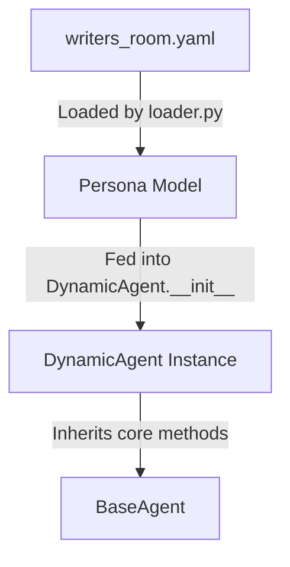

Here is the updated project plan, refactored to transition from a hardcoded "Writer's Room" to a highly extensible, **Configuration-Driven Architecture**. This will allow you to instantly spin up an Agentic Group Chat, a Shark Tank, or a Drug Design lab simply by swapping out a configuration file.

# AI Boardroom — Project Plan

> **Status**: ✅ Core backend scaffolded. 🔄 Refactoring for Extensibility (Phase 2 active)
> **Last Updated**: 2026-06-10

---

## Project Overview

A highly scalable, multi-workflow orchestration platform. By utilizing **Room Templates**, the system dynamically instantiates specialized AI personas, custom state machines, and dynamic action tools to simulate any collaborative environment (Writer's Room, Shark Tank, Drug Design Lab, etc.). Orchestrated via LangGraph on a FastAPI backend with WebSocket streaming.

---

## Architecture (Configuration-Driven)

```text
POST /ai_room/create
        │ Loads JSON/YAML Room Template (e.g., shark_tank.yaml)
        ▼
  [Initialization]
  System dynamically provisions Personas, Tools, and Stage Logic
        │
        ▼
  [Continuous Loop / Dynamic Stages]
  Client ──── WS Stream ───► Orchestrator Agent (Silent Semantic Router)
                                │
                                ├── intent_analysis?
                                ├── tool_routing?
                                │
                                ▼
  [Agent Action Space]
  Dynamic Agent A (e.g., Investor) ──► Uses Tool (e.g., make_offer())
  Dynamic Agent B (e.g., SME)      ──► Processes silently in isolated scratchpad
                                │
                                ▼
  Orchestrator Agent ──► Synthesizes actions ──► Updates Synchronized Shared Memory
                                │
                                ▼
  [Dynamic UI Rendering]
  FastAPI pushes UI Layout Frames (e.g., {"layout": "split_screen_deal_tracker"}) alongside tokens

```

---

## Technology Stack

| Layer | Technology |
| --- | --- |
| Backend API | Python FastAPI |
| Configuration | YAML / JSON (Room Templates) |
| Streaming | WebSockets (FastAPI native) |
| Agent Orchestration | LangChain + LangGraph (Dynamic Graph Building) |
| LLM Clients | Google Gemini (genai), OpenRouter |
| Auth | JWT (python-jose) via `Sec-WebSocket-Protocol` header |
| Frontend | React + Vite + TypeScript + Zustand (Componentized UI) |
| Validation | Pydantic v2 |

---

## Isolation Rules (Enforced)

| Role | Private Scratchpad | Public Group Chat Output |
| --- | --- | --- |
| **Orchestrator** | Intent analysis, routing decisions, tool evaluation | UI Layout frames, synthesized summaries, turn handoffs |
| **Dynamic Agent** | Intermediate reasoning, domain-specific calculations | Final structured output (e.g., `DealOffer`, `MolecularStructure`, `ScriptDraft`) |

**Enforcement mechanism:**

* Each agent holds `_scratchpad: list[dict]` — a private instance variable.


* Scratchpad is populated by `agent.think()` (private reasoning).


* Scratchpad is **cleared** by `agent.respond()` after producing the public output.
* 
`RoomSharedState` (the LangGraph shared state) **never contains scratchpad data**.


* The Orchestrator manages these scratchpads to let agents formulate thoughts before speaking.


---

## Repository Structure

```text
V0005_Extensible_AI_Boardroom/
├── backend/
│   ├── main.py                          ✅ FastAPI app factory
│   ├── requirements.txt
│   ├── .env.example
│   │
│   ├── core/
│   │   ├── config.py                    ✅ Pydantic-settings
│   │   ├── security.py                  ✅ JWT via WS protocol
│   │   └── templates/                   🔄 NEW: Room Configurations
│   │       ├── writers_room.yaml
│   │       ├── shark_tank.yaml
│   │       └── drug_design.yaml
│   │
│   ├── agents/
│   │   ├── base_agent.py                ✅ BaseAgent with isolated _scratchpad
│   │   ├── orchestrator.py              🔄 NEW: Silent semantic router
│   │   ├── dynamic_agent.py             🔄 NEW: Instantiated via Room Template
│   │   └── tools/                       🔄 NEW: Dynamic Tool Registry
│   │       ├── script_tools.py
│   │       ├── investor_tools.py        (e.g., make_offer)
│   │       └── biotech_tools.py
│   │
│   ├── graph/
│   │   ├── state.py                     ✅ RoomSharedState TypedDict
│   │   ├── nodes.py                     ✅ Generic node execution functions
│   │   └── dynamic_graph_builder.py     🔄 NEW: Compiles LangGraph dynamically from template stages
│   │
│   ├── llm_clients/                     ✅ (Untouched) Gemini & OpenRouter clients
│   ├── api/
│   │   ├── schemas.py                   ✅ Pydantic request/response models
│   │   └── routes/
│   │       ├── auth.py
│   │       └── room_manager.py          🔄 NEW: Handles template loading and WS /ws/room/{id}
│   │
│   └── tests/
│
├── frontend/
│   ├── package.json
│   └── src/
│       ├── api/
│       ├── store/
│       └── components/                  🔄 NEW: Pluggable UI widgets
│           ├── layouts/                 (ChatOnly, SplitScreen, Canvas)
│           └── widgets/                 (DealTracker, ScriptSidebar, MoleculeViewer)
└── plan.md

```

---

## Phase Roadmap

### ✅ Phase 1 — Core Infrastructure (DONE)

* Backend FastAPI application factory & JWT security.
* BaseAgent with isolated private scratchpad.


* LangGraph shared state documented isolation boundary.


* `WS /ws/boardroom/{session_id}` with JWT via `Sec-WebSocket-Protocol`.

### 🔄 Phase 2 — Configuration-Driven Refactoring (Current)

* [x] Implement `Room Templates` loader (parse YAML/JSON configs for personas and stages).


* [x] Build the `dynamic_graph_builder.py` to compile LangGraph state machines based on the loaded template's stages.


* [x] Replace hardcoded Director/Writer with a generic `DynamicAgent` class that absorbs a persona from the config.

* [x] Finalize the user journey for the writers' room flow - what is the steps happening in each stage, and what are the parameters which decide the completion of the stage, and what is the conversation, etc within each step of each stage. 

* [x] Add the activities for the tech_SME RAG pipeline & also feature list based on free members and paid members.

* [x] Update the base agent so that it includes the characteristic parameters of different agents.

* [x] Understand what exactly is happening in Agents currently and what will be the process of creating a new template room as well as how to create new agents ? What will be the process to create the Director, Tech SME, Writer, Critic?

* [ ] Understand and run test_dynamic_agent.py annd create the environment, etc to make sure we are able to get this running successfully for a dummy testcase.

* [ ] Create all the agents using the role, system prompt for Director, Tech SME, Writer, Critic. Make sure the invoke method is implemented properly with the user prompt as per chat : https://gemini.google.com/share/811172d56741.

* [ ] Finalize the format of the JSON story prototype.

* [ ] Implement the silent `Orchestrator` agent to handle routing and turn-taking.


* [ ] Build the `Tool Registry` to assign environment-specific action spaces (e.g., `make_offer` tool for Shark Tank).


* [ ] Create the end-to-end flow from the FastAPI endpoint for the `writers_room` flow for the different stages implementation and responses from each of the agents.


* [ ] Do the backend testing for the end-to-end `writers_room` flow for 5 different test scenarios.

### 🔲 Phase 3 — Componentized Frontend UI

* [ ] Setup Zustand store to interpret UI Layout frames pushed by the FastAPI backend.


* [ ] Build pluggable layout containers that mount/unmount seamlessly without interrupting the WebSocket token stream.


* [ ] Develop domain-specific widgets (e.g., "Deal Tracker" for Shark Tank, "Review Sidebar" for Writer's Room).

* [ ] Prepare the Youtube Videos 1-3

### 🔲 Phase 4 — Testing & Production Hardening

* [ ] Integration tests for template loading and dynamic graph building.
* [ ] Test the Orchestrator's ability to isolate scratchpads across different dynamic agents.
* [ ] Replace stub user store with PostgreSQL/NeonDB.
* [ ] Docker Compose (backend + frontend) & CI/CD pipeline.

### 🔲 Phase 5 — Go-To-Market & Business Operations (H2 2026)

* [ ] Prepare the Youtube Videos 4-6

* [ ] **Legal Registration:** Register as a Sole Proprietorship via the Udyam portal (MSME) to establish a formal entity quickly without overhead.
* [ ] **Financial Setup:** Open a business Current Account to strictly separate SaaS and YouTube revenue from your primary 35 LPA salary. Also decide a suitable price point for SaaS products suite based on deep research. Basic pricing_strategy.md is ready.
* [ ] **Payments & Compliance:** Complete GST registration (necessary for international software service export) and finalize Stripe/Razorpay merchant approval.
* [ ] **Sponsorship Outreach:** Create a 1-page channel Media Kit and execute cold email pitches to target AI developer tools (e.g., Pinecone, LangChain) to secure the 3 video sponsorships.

* [ ] Release the Youtube Videos 7-10.

* [ ] **Launch Wedge Execution:** Draft distribution posts and map out the release schedule for developer communities, including Hacker News, Reddit (r/LocalLLaMA, r/SideProject), and X/Twitter.
---

## Key Design Decisions

1. 
**Room Templates (YAML/JSON)**: Moving away from hardcoded logic, the application flow is now entirely dictated by config files defining the roster, the stages (e.g., `["pitch", "q_and_a", "bidding"]`), and the required tools.


2. **The Silent Orchestrator**: The "Director" is replaced by a background Semantic Router. It analyzes user intent and dictates which agent acts, removing the reliance on a visible "boss" agent for casual group chats or adversarial formats like a Shark Tank.


3. **Dynamic UI Rendering**: The frontend no longer follows a linear progression. The backend pushes UI layout frames (e.g., `{"layout": "split_screen_deal_tracker"}`). The React client intercepts these frames and mounts widgets dynamically, allowing a single frontend to support entirely different use cases.


4. **Environment Action Spaces (Tools)**: Agents are granted specific capabilities based on the active template. A Shark Tank investor agent can execute a `make_offer()` function, which the backend routes directly to the frontend's Deal Tracker UI.


## FAQs

### 1. Explain the need of the Silent Orchestrator

Ans. In a robust multi-agent architecture (like LangGraph or AutoGen), there is a crucial distinction between the **Director** and the **Silent Orchestrator**:

* **The Director (Persona):** An LLM-driven agent that acts as the "creative lead." It talks to the user, gives natural language commands to other agents, and synthesizes the narrative.
* **The Silent Orchestrator (System/Graph Router):** The code-driven backend state machine (your `dynamic_graph_builder.py`). It does not generate creative text. Instead, it parses the YAML, builds the graph, decides *whose turn it is to speak*, manages the shared memory, and handles the actual tool execution.

If you drop the Silent Orchestrator, your agents will talk over each other in an infinite loop.


### 2. Explain what is happening in the agent files. How is BaseAgent different from DynamicAgent? 

Ans. The agent system is divided into two primary parts: the core structural class and the configuration-driven wrapper.

*   **[BaseAgent]** : Acts as the foundation. It includes the following key things:
    *   Location: backend\agents\base_agent.py
    *   Initialized using parameters: `name`, `persona`, `llm`, `system_prompt`, `max_argument_quota`, `synthesize_json_template`.
    *   **Memory Isolation Boundary**: A private `_scratchpad` list that holds intermediate chain-of-thought reasoning via `think()`. This is kept isolated. Calling public methods like `respond()` or `respond_structured()` wipes this scratchpad internally before returning a final output.
    *   It has 3 helper methods related to the _scratchpad - `_scratch_append`, `_scratch_clear`, `get_scratchpad_snapshot`.
    *   The core  methods are: `think()`, `respond()`, `respond_structured()`, `run()`.

*   **[DynamicAgent]: A subclass of `BaseAgent`. It removes hardcoded code paths by absorbing a configuration model `Persona` at runtime.
    *   It dynamically constructs the LLM system prompt:
        ```python
        system_prompt = (
            f"You are {persona_config.display_name or persona_config.id}.\n"
            f"Your Role: {persona_config.role}\n"
            f"Description: {persona_config.description}\n\n"
            f"Follow all instructions and stay in character. Provide structured and concise outputs."
        )
        ```
    *   It runs a two-step node execution flow `execute()` where it silently plans/reasons in the `_scratchpad` and then outputs a clean public response to update `DynamicRoomState`.

### 3. What is the connection between the YAML configuration and the Agents?
The connection is established via the loader pipeline:



1.  **Define Configuration**: [writers_room.yaml](file: backend/core/templates/writers_room.yaml) contains raw persona text blocks defining tools, names, descriptions, quotas, and template schemas.
2.  **Parse and Validate**: [loader.py](file: backend/core/templates/loader.py) uses Pydantic to validate and load this file into structured models like `Persona`.
3.  **Instantiate**: The code maps the active graph nodes using the `Persona` configuration objects and initializes [DynamicAgent](file: backend/agents/dynamic_agent.py) instances.

---

### 3. How is a `BaseAgent` different from a `DynamicAgent`?
*   **[BaseAgent](file:///c:/Users/ABC/Projects/A0011_RxAI_YT_Videos/V0004_Agentic_AI_Boardroom/backend/agents/base_agent.py)** defines the **functional blueprint** (interacting with LLMs, managing internal memory, clearing scratchpads, formatting system messages). It is generic and does not care about your specific domain or template.
*   **[DynamicAgent](file:///c:/Users/ABC/Projects/A0011_RxAI_YT_Videos/V0004_Agentic_AI_Boardroom/backend/agents/dynamic_agent.py)** acts as the **runtime wrapper** that maps configuration values (such as `max_argument_quota` or `synthesize_json_template`) into system prompts, tools, and actions for specific use cases (e.g. Writer's Room, Shark Tank).

### 4. What are the steps to create a new agent?
To add a brand new agent type (for example, a "Marketing Specialist"):

1.  **Define in Template**: Add the new persona to the `personas:` list in your room YAML template:
    ```yaml
    - id: marketer
      role: "Campaign Strategist"
      display_name: "Lead Marketer"
      tools: ["analyze_market", "draft_copy"]
      description: "Optimizes messaging structure."
      max_argument_quota: 3
    ```
2.  **Load and Initialize**:
    ```python
    from core.templates.loader import load_template
    from agents.dynamic_agent import DynamicAgent
    from llms.registry import get_llm

    template = load_template("core/templates/writers_room.yaml")
    marketer_config = next(p for p in template.personas if p.id == "marketer")
    llm = get_llm("gemini")
    
    marketer_agent = DynamicAgent(persona_config=marketer_config, llm=llm)
    ```

---

### 5. What are the steps needed to instantiate the Director, Tech SME, Writer, and Critic?
Rather than writing four distinct Python files, you load their respective block parameters dynamically:

1.  **Parse the Room Config**:
    ```python
    template = load_template("backend/core/templates/writers_room.yaml")
    llm = get_llm("gemini")
    ```
2.  **Instantiate Director**:
    ```python
    director_config = next(p for p in template.personas if p.id == "director")
    director = DynamicAgent(persona_config=director_config, llm=llm)
    ```
3.  **Instantiate Tech SME**:
    ```python
    sme_config = next(p for p in template.personas if p.id == "tech_sme")
    tech_sme = DynamicAgent(persona_config=sme_config, llm=llm)
    ```
4.  **Instantiate Writer**:
    ```python
    writer_config = next(p for p in template.personas if p.id == "writer")
    writer = DynamicAgent(persona_config=writer_config, llm=llm)
    ```
5.  **Instantiate Critic**:
    ```python
    critic_config = next(p for p in template.personas if p.id == "critic")
    critic = DynamicAgent(persona_config=critic_config, llm=llm)
    ```